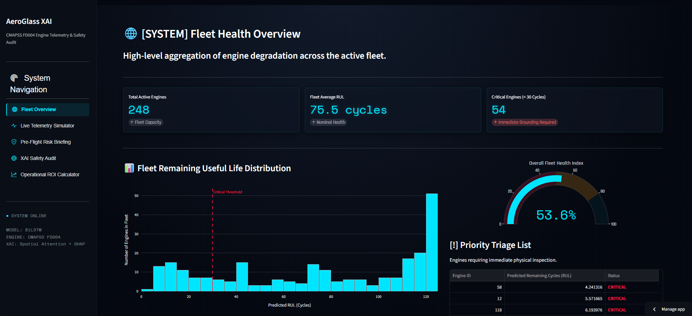

# AeroGlass XAI
A real-time predictive maintenance dashboard utilizing Explainable AI to forecast aerospace engine failures and translate predictive accuracy into financial ROI.

[](https://aeroglass-xai-guyrcky3rrh5drscsb9uhu.streamlit.app/)


*Note: If the dashboard is hibernating due to inactivity, click "Wake App" and it will boot in under 30 seconds.*

## 🚀 Quick Start
AeroGlass XAI is fully deployed on the cloud. No installation is required to view the telemetry. 
**[Launch the Live Dashboard Here](https://aeroglass-xai-guyrcky3rrh5drscsb9uhu.streamlit.app/)**

## 🛡️ Core Features
* **Live Telemetry Streaming:** Monitoring thermodynamic sensor feeds in real-time alongside dual predictive models.
* **Explainable AI (XAI) Audits:** Extracting cycle-level spatial SHAP feature attribution to translate complex neural network weights into actionable mechanical insights.
* **Pre-Flight Risk Briefing:** Generating immediate "GO / NO-GO" safety diagnostics for specific aircraft engine pairings.
* **Operational ROI Calculator:** Calculating the exact financial break-even point between preventative maintenance and AI false-negative catastrophic failures.

## 🛠️ How to Run Locally
If you wish to run the telemetry server on your local machine:

1. Clone the repository:
   ```bash
   git clone https://github.com/saminsiddiqui08-beep/AeroGlass-XAI.git
   cd AeroGlass-XAI
   ```

2. Install the required dependencies:
   ```bash
   pip install -r requirements.txt
   ```

3. Boot the Streamlit server:
   ```bash
   streamlit run app.py
   ```

## 🧠 Technical Architecture
Pure predictive accuracy is insufficient in safety-critical domains like aerospace. Human engineers must be able to audit the AI.

AeroGlass runs a Baseline Dual-Layer BiLSTM alongside a custom Temporal Attention BiLSTM. While the baseline model operates as an uninterpretable "Black Box," the AeroGlass model extracts SHAP matrices to definitively isolate the mechanical stressors driving a failure (e.g., thermal stress vs. rotational mechanics). The front-end is engineered using Streamlit and Plotly, utilizing mmap_mode and @st.cache_resource to fluidly stream heavy multi-dimensional tensor arrays in real-time without memory bloat.

## 🤝 Credits
* Built with [Streamlit](https://streamlit.io/) and [Plotly](https://plotly.com/).
* Dataset: NASA CMAPSS (Commercial Modular Aero-Propulsion System Simulation) Turbofan Degradation Data.